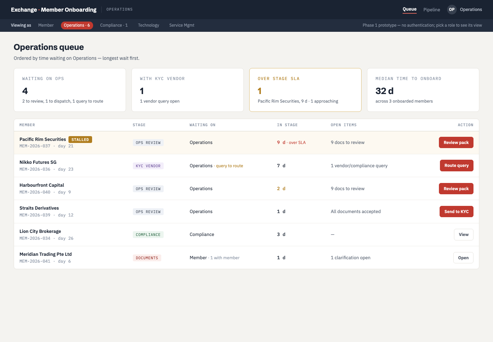
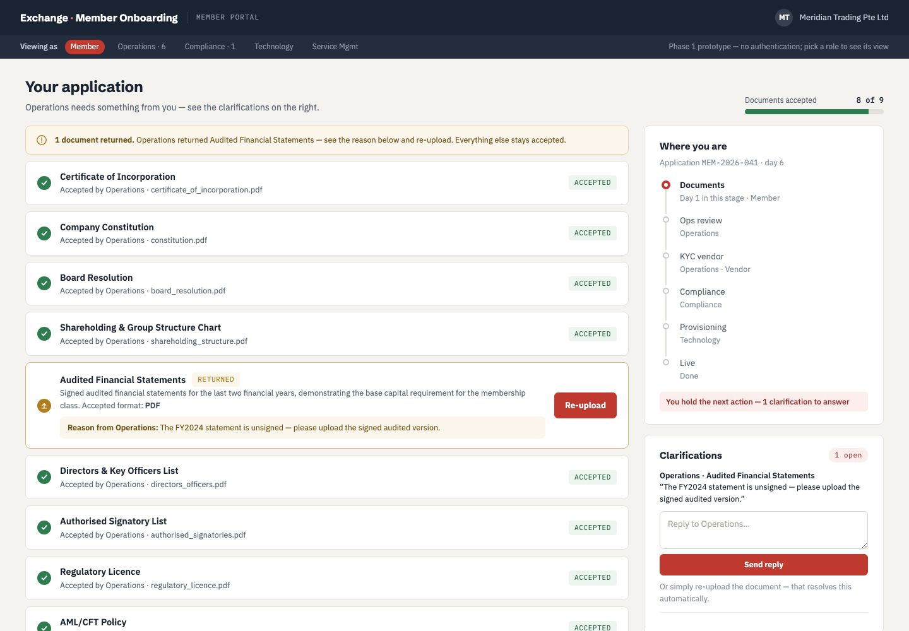

# Exchange Member Onboarding Portal

A working Phase-1 build of the member onboarding portal: one shared workspace
that takes a prospective member from invitation to go-live, replacing the
email threads between the member, Operations, the KYC vendor and Compliance.

Built from the PRD and screen designs in this repo (`docs/`, `mockups/`).



## Run it

```bash
./.venv/bin/python app.py
```

Then open <http://localhost:5001>. The database is seeded automatically on
first run. To reset the demo data at any time:

```bash
./.venv/bin/python seed.py
```

There is no authentication in Phase 1 — the dark bar at the top switches
between the five roles, so one person can walk the whole flow.

## The flow

The application moves through explicit stages, each with exactly one owning
team, so "who holds the next action" is never ambiguous:

```
INVITED → DOCUMENTS → OPS_REVIEW → KYC → COMPLIANCE → PROVISIONING → LIVE
                                              └────────→ REJECTED
```

- **Service Management** creates the application and invites the member. The
  time-to-onboard clock starts here.
- **Member** fills the application form *in the portal* (not a PDF upload) and
  uploads 9 supporting documents. Format and size are validated at the point of
  upload; submission is blocked until the form, the declaration and every
  document are in.
- **Operations** accepts or returns each document individually. A return names
  the reason and moves *only that document* back to the member — the loop is
  per-document, not per-application. Once everything is accepted, Ops dispatches
  the pack to the KYC vendor.
- **KYC vendor** works on its existing channel; Ops records queries and the
  final result in the portal.
- **Compliance** sees the form, the pack, the KYC result and the full query
  history on one page, and records approve/reject with a rationale.
- **Technology** gets a provisioning checklist opened automatically on approval,
  and marks the member live — which stops the clock.

The member's view of the same moment — per-document status, the live stage
timeline, and the clarification they need to answer:



## Two rules the code enforces

**Operations is the single channel.** The KYC vendor and Compliance never reach
the member directly. Their queries land in the Ops queue as `TO_ROUTE` items and
become visible to the member only when Ops routes them onward
(`models.route_to_member`). `test_app.py` asserts the member cannot see a vendor
query before that happens — it is the rule most likely to be broken by a
well-meaning change.

**The metric is derived, never stored.** Every stage transition is timestamped
in `stage_history`. Time to onboard, time in stage, first-time-right and
round-trips are all computed from it (`models.metrics`), so they cannot drift
out of step with what actually happened.

## Layout

| File | What it holds |
|---|---|
| `app.py` | Flask routes, one section per persona |
| `models.py` | SQLite schema, the state machine, and the metrics |
| `documents.py` | The 9-document checklist and the in-portal form definition |
| `seed.py` | Demo applications matching the screen designs |
| `templates/` | Screens; `base.html` holds the design system |
| `docs/prd.html` | The PRD this build implements |
| `mockups/` | Screen designs and the click-through prototype |
| `pdf/` | Print versions of the PRD, designs and walkthrough |
| `docs/screenshots/` | Screenshots of the running portal |

## Verify

```bash
./.venv/bin/python test_app.py
```

41 checks walking one member from invitation to live, through every actor —
including the validation gates, the per-document return loop, and the
Ops-routing rule above.

## Deferred on purpose

- **KYC vendor API integration.** Version 1 keeps the vendor on its existing
  channel with Ops recording dispatches, queries and results. That costs Ops
  some re-keying, but the flow doesn't wait on a vendor integration — and
  because everything is captured from day one, the API slots in later without
  rework.
- **Authentication and SSO.** The role switcher stands in for it.
- **Email notifications.** The PRD specifies them; the portal shows the state
  they would link to.
- **One checklist for all membership classes.** Class-specific documents can be
  added as extra checklist items without structural change.
- **Data residency and retention.** A production concern; uploads are stored
  locally and are git-ignored.

## A note on the numbers

The metric values in `mockups/` are illustrative samples drawn by hand. The
running app computes its own from the seeded history, so the two differ
slightly — the app's are the real calculation, and they change as you drive the
demo (return a document, and first-time-right drops).
